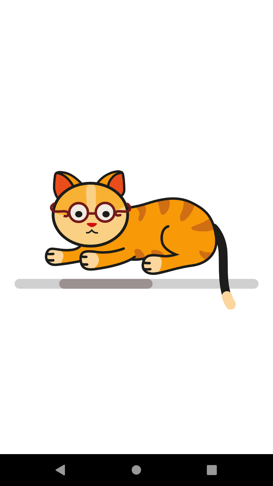

# CatBreeds
Cat Breeds App using The Cat API

* Dagger-Hilt for Dependency Injection
* Room DB for local database
* Retrofit for network call
* ViewModel
* Flow-Coroutines
* Clean Architecture
* Web View
* RecyclerView
* Jetpack Navigation
* <a href="https://github.com/bumptech/glide" target = "_blank">Glide</a> 
* <a href="https://github.com/vinc3m1/RoundedImageView" target="_blank">Rounded </a>
* <a href="https://lottiefiles.com/" target="_blank"> Lottie Animations </a>

 </img>
 </img> 
 </img> 
 </img> 
 </img> 
